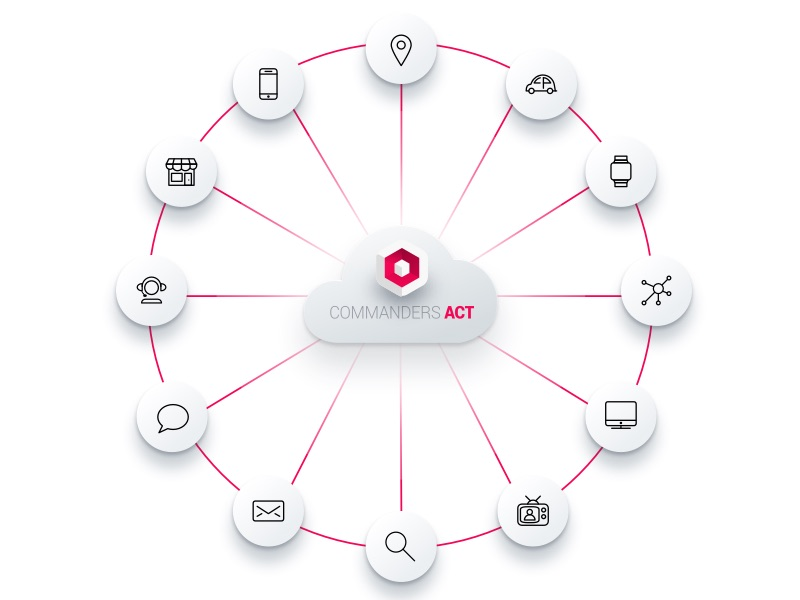

# Overview

New customer acquisition costs continue to rise but conversion rates have remained flat at 2.5%-5%. Brands are increasingly collecting data insights such as behavioral, demographic, psychographic, etc., from each and every lead and customer interaction because they know it can be used to improve their marketing campaign performance.

What’s more, it’s critical that this data is stored in a secure location that adheres to the various privacy laws, yet is accessible by your marketing orchestration platforms and other internal and external sources.

That’s why it’s imperative you collect data from every lead and customer interaction. You should also cleanse, standardise and store it in a centralised database that’s accessible by all of your marketing channels, or used by your sales and customer service agents in your CRM platform.

